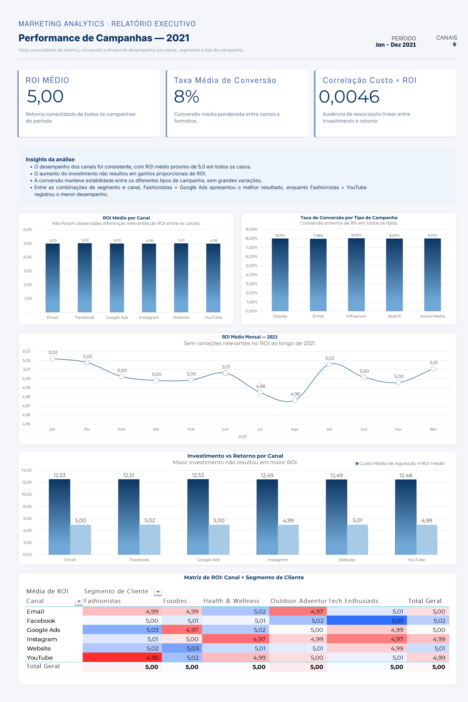

# Análise de Performance de Campanhas de Marketing



## TL;DR

Análise de mais de 200 mil campanhas de marketing, testando canal, segmento de cliente, tipo de campanha, custo, engajamento e comportamento temporal como possíveis fatores explicativos de desempenho. Nenhuma variável apresentou poder explicativo consistente sobre o ROI ou a taxa de conversão. O resultado é compatível com uma base sintética. O projeto demonstra a importância de testar hipóteses com métodos múltiplos e reportar a ausência de padrão como um resultado válido, tão relevante quanto um insight positivo.

---

## Base Analisada

- **200.005** campanhas
- **5** empresas
- **6** canais (Google Ads, YouTube, Instagram, Website, Facebook, Email)
- **5** segmentos de clientes (Fashionistas, Foodies, Health & Wellness, Outdoor Adventurers, Tech Enthusiasts)
- **Período:** janeiro a dezembro de 2021

## Objetivos da Análise

Responder às seguintes perguntas de negócio:

- Existe algum canal mais eficiente que os demais?
- Existe algum tipo de campanha com desempenho superior?
- O ROI evolui ou varia ao longo do tempo?
- Existe relação entre investimento (custo de aquisição) e retorno?
- O engajamento se traduz em mais conversão?
- Existem padrões consistentes que expliquem campanhas de alto ou baixo desempenho?

---

## O Ponto de Partida

A pergunta por trás desse projeto era simples: o que faz uma campanha performar melhor que outra? É a pergunta que qualquer time de marketing faz o tempo todo.

Como hipótese inicial, a expectativa era encontrar respostas como "Facebook converte mais" ou "campanhas de Influencer trazem o melhor ROI". São os tipos de insight que costumam virar recomendação estratégica.

## O que a Investigação Revelou

Para responder a essas perguntas, foram aplicadas diferentes abordagens analíticas, cada uma testando a hipótese central por um ângulo específico: existe algum fator capaz de explicar o desempenho das campanhas?

**Análise univariada.** Nem canal, nem tipo de campanha, isoladamente, mostraram diferença relevante de ROI ou conversão entre categorias. As variações ficaram sempre abaixo de 0,03 pontos.

**Análise bivariada.** Combinar canal e segmento de cliente também não revelou nenhum ponto de destaque. O heatmap gerado mostrou um padrão uniforme, sem concentração de desempenho em nenhuma combinação específica.

**Eficiência dos canais.** Custo por clique (CPC) e taxa de cliques (CTR) se mostraram equivalentes entre os canais. Existe grande variação individual entre campanhas (CTR de 1,5% a 49%), mas essa variação não se explica pelo canal.

**Análise dos extremos.** Usando percentis para definir objetivamente campanhas de alto e baixo desempenho, em vez de uma checagem visual nas primeiras linhas, a distribuição desses extremos se mostrou praticamente idêntica entre canais. Cerca de 10% em cada categoria, como seria esperado pelo acaso.

**Análise temporal.** O ROI mensal ao longo de 2021 permaneceu estável, sem sazonalidade ou tendência de crescimento ou declínio.

**Hipótese de engajamento.** Mesmo a relação mais óbvia, de que engajamento alto deveria gerar mais conversão, não se sustentou nos dados. A correlação encontrada foi de -0,00065.

## A Virada da História

Em nenhuma das hipóteses testadas foi encontrada evidência de que as variáveis disponíveis explicassem, de forma consistente, a variação de desempenho das campanhas.

Isso não é uma falha da análise. É o próprio resultado dela. Múltiplos métodos independentes (comparação de médias, correlação, cruzamento de dimensões, análise de outliers por percentil, série temporal) convergiram para a mesma ausência de padrão. Isso deixa de ser coincidência e passa a representar um resultado consistente.

---

## Principais Descobertas

✔ Não foi encontrada diferença relevante de ROI entre canais.

✔ Não foi encontrada diferença relevante entre tipos de campanha.

✔ Não houve correlação entre custo de aquisição e ROI (r = 0,0046).

✔ O cruzamento canal × segmento não revelou combinações de destaque.

✔ CPC e CTR médios foram equivalentes entre todos os canais.

✔ Outliers de alto e baixo desempenho se distribuíram igualmente entre canais.

✔ Não houve sazonalidade no ROI ao longo de 2021.

✔ Não houve correlação entre engajamento e conversão (r = -0,00065).


## O que Isso Significa na Prática

A leitura mais honesta dos dados é que as variáveis disponíveis nesta base (canal, tipo de campanha, empresa, segmento, custo, engajamento, tempo) não demonstraram poder explicativo para a variação de desempenho das campanhas. Isso sugere dois cenários possíveis:

1. O desempenho de campanhas reais depende de fatores não capturados neste dataset, como qualidade do criativo, timing de mercado, concorrência ou sazonalidade de produto específico.
2. A base foi gerada de forma sintética ou aleatória para fins de treino, sem relações de causalidade reais embutidas. Esse é um cenário comum em datasets públicos usados para fins educacionais.

---

## Dashboard

O dashboard consolida visualmente os principais achados da análise. Abaixo está a leitura de cada elemento:

| Elemento do Dashboard | O que ele mostra | Por que isso é relevante |
|---|---|---|
| ROI médio = 5,00 | Retorno consolidado de todas as campanhas | O número em si é menos importante que sua uniformidade entre categorias |
| Taxa média de conversão = 8,01% | Conversão consolidada de todas as campanhas | Uniforme entre canais e formatos, sem destaque de nenhum tipo |
| Correlação Custo × ROI = 0,0046 | Ausência de associação linear entre investimento e retorno | Base para a conclusão de que investir mais não gera mais retorno |
| ROI por canal (barras) | Todos os canais entre 4,99 e 5,02 | Diferença insignificante. Nenhum canal se destaca |
| Conversão por tipo de campanha (barras) | Display 8,01% / Email 7,98% / Influencer 8,03% / Search 8,00% / Social Media 8,01% | Valores praticamente idênticos. Tipo de campanha não explica conversão |
| ROI mensal (linha) | Variação de 4,95 a 5,02 ao longo de 2021 | Sem tendência ou sazonalidade. Tempo não explica desempenho |
| Investimento vs Retorno por Canal (barras duplas) | Investimento médio ao redor de R$ 12,5 mil em todos os canais, com ROI médio ao redor de 5,00 | Substitui a dispersão de Custo × ROI, mostrando o mesmo achado de forma mais direta: não existe canal em que gastar mais compensa mais |
| Matriz Canal × Segmento (heatmap) | Todos os valores entre 4,95 e 5,05 | Distribuição uniforme. As combinações de maior e menor valor (Google Ads + Fashionistas, YouTube + Fashionistas) ficam dentro dessa faixa estreita, sem representar diferença estatisticamente relevante |

A uniformidade dos dados em todas as dimensões analisadas é a própria confirmação visual da conclusão: não há padrão consistente que explique o desempenho das campanhas.

Nota: a análise de correlação entre engajamento e conversão (r = -0,00065) foi conduzida durante a investigação, mas não está representada visualmente no dashboard final. O achado permanece documentado nas seções anteriores deste relatório.

---

## Por que Essa Conclusão Importa

Um erro comum em análises exploratórias é forçar uma narrativa positiva onde ela não existe. Escolher a menor diferença entre médias e apresentar como descoberta é um exemplo disso. Esta análise seguiu o caminho oposto: testou a mesma hipótese repetidamente, com rigor crescente, da comparação simples de médias até a classificação por percentil, e reportou a ausência de padrão como resultado válido.

A análise não identificou fatores preditivos de desempenho, mas demonstrou a importância de validar hipóteses antes de transformar diferenças numéricas em decisões de negócio. Em análise de dados, concluir que não existe evidência suficiente para sustentar uma hipótese é tão importante quanto encontrar uma relação significativa.

## Aprendizado Pessoal

O principal aprendizado deste projeto foi entender que, em análise de dados, concluir que uma hipótese não se sustenta é tão relevante quanto confirmá-la. A experiência trouxe três lições práticas:

- Valorizar a robustez metodológica em vez de buscar insights a qualquer custo.
- Aplicar múltiplas abordagens à mesma pergunta para verificar consistência.
- Reconhecer que dados sintéticos têm valor educacional, mas exigem transparência sobre suas limitações.

---

## Competências Demonstradas

- Limpeza e preparação de dados
- Criação de métricas derivadas (CTR, CPC e Faixa de ROI)
- Análise Exploratória de Dados (EDA)
- Formulação e teste de hipóteses
- Correlação entre variáveis
- Análise temporal
- Identificação de outliers utilizando percentis
- Construção de Tabelas Dinâmicas
- Visualização de dados e criação de dashboard
- Comunicação de resultados baseada em evidências

## Ferramentas Utilizadas

- Microsoft Excel
- Tabelas Dinâmicas, incluindo cruzamento de múltiplas dimensões e contagem
- Formatação Condicional (escala de cores para heatmap)
- Colunas calculadas: CPC, CTR e Faixa_ROI
- Funções: `CORREL`, `PERCENTIL.INC`, `SE`, `MÉDIASE`
- Texto para Colunas, para padronização de dados de data

## Limitações da Análise

- O dataset apresenta características compatíveis com dados sintéticos, o que limita a generalização dos resultados para cenários reais.
- Não foi possível estabelecer relações de causa e efeito entre as variáveis disponíveis.
- Os resultados estão restritos às variáveis presentes na base e não contemplam fatores como qualidade do criativo, orçamento por público-alvo, concorrência ou contexto de mercado.
- Não foram aplicados testes de inferência estatística formal, como teste t, ANOVA ou regressão com significância. As conclusões se baseiam em análise exploratória: médias, correlação, percentis e cruzamento de dimensões.

---

## Fonte dos Dados

[Marketing Campaign Dataset, Kaggle](https://www.kaggle.com/datasets/guelmaniloubna/marketing-campaign-dataset)

Download via código Python:

```python
import kagglehub

# Download da versão mais recente
path = kagglehub.dataset_download("guelmaniloubna/marketing-campaign-dataset")
print("Path to dataset files:", path)
```

---

*Metodologia: Microsoft Excel. Tabelas Dinâmicas, funções CORREL, PERCENTIL.INC, SE, MÉDIASE, colunas calculadas, formatação condicional e criação de dashboard.*
